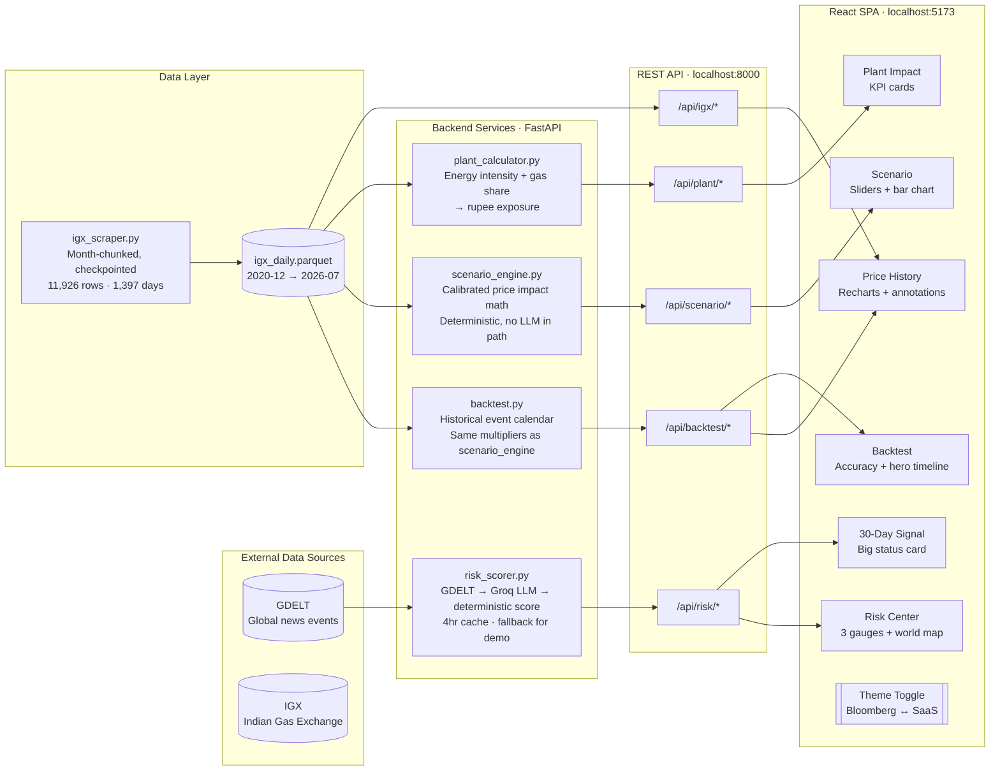
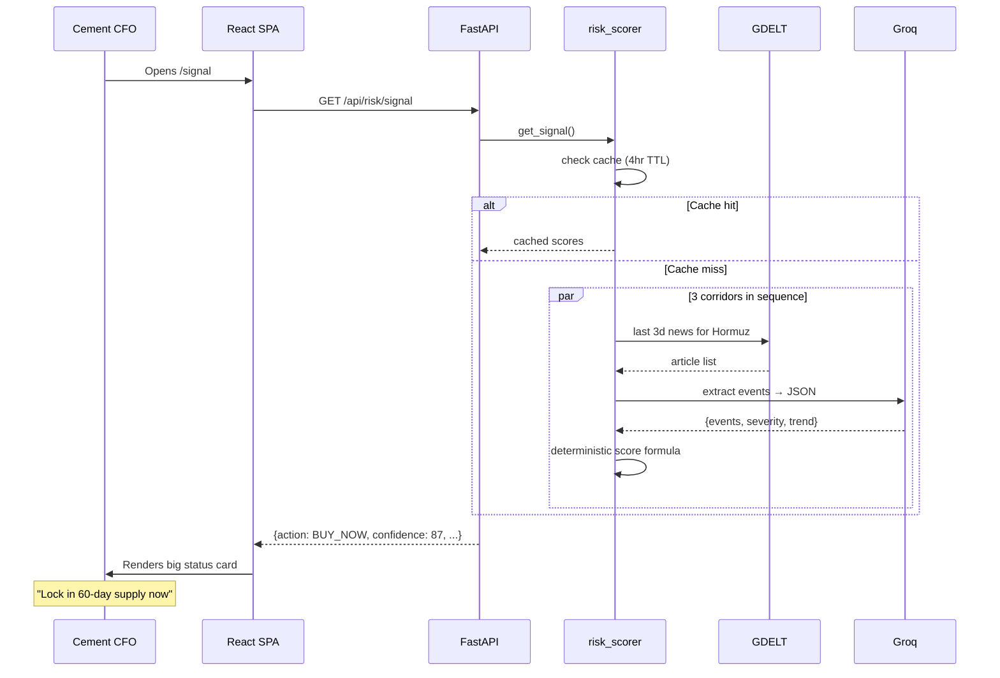

# CruxIQ Architecture

## System overview

## Data flow: how a demo works

## Design principles

1. **LLM extracts, formula scores.** No hallucinated numbers reach the recommendation.
2. **Same math forward and backward.** Scenario simulation and backtest share multipliers.
3. **Never block the demo.** GDELT slow? Use calibrated fallback. Groq missing key? Skip and use baseline score.
4. **Checkpoint everything.** Scraper saves after each month. If the process dies, nothing is lost.
