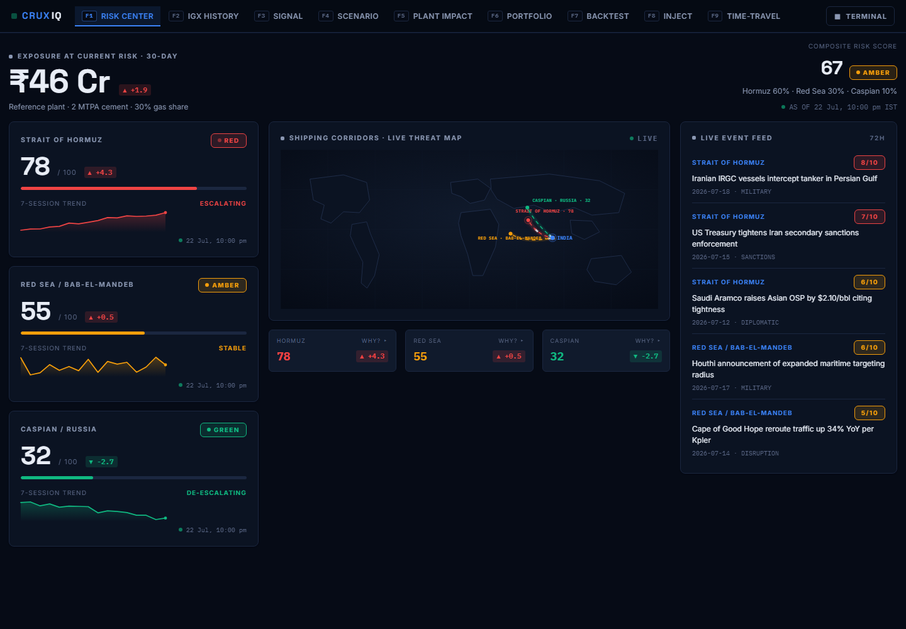
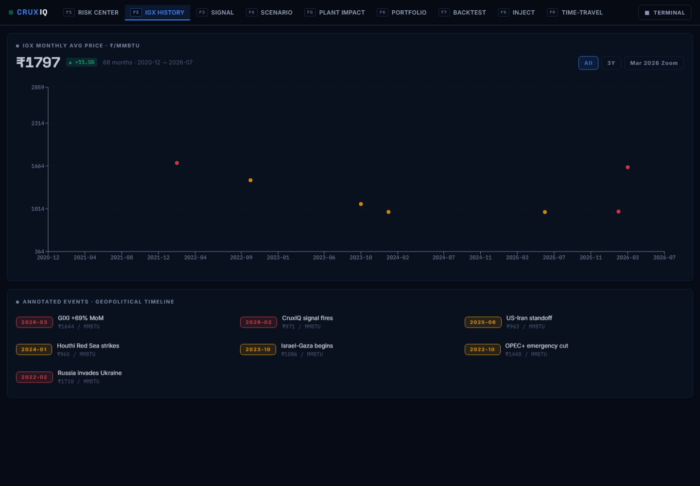
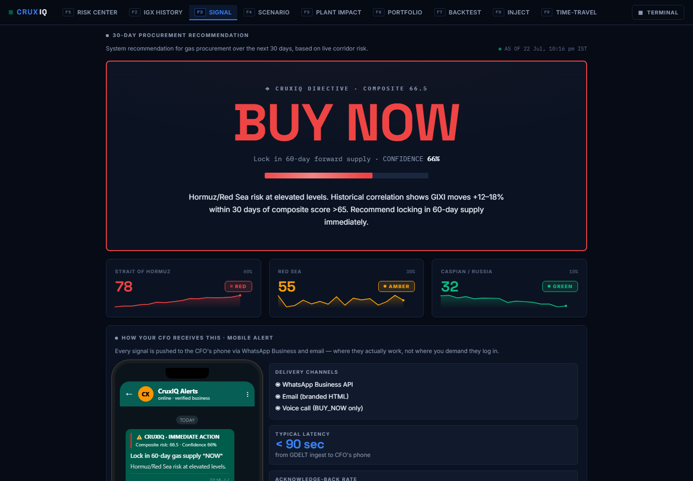
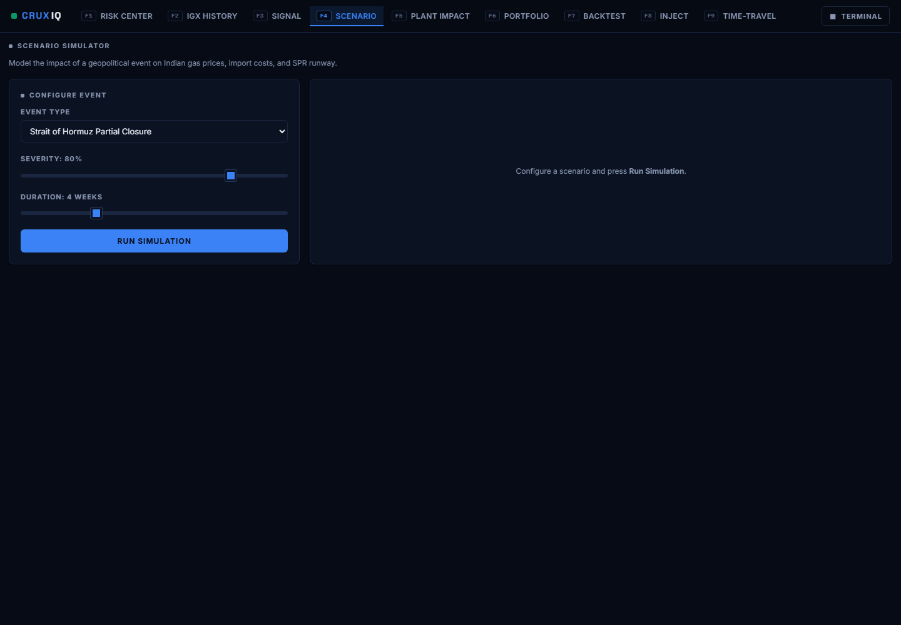
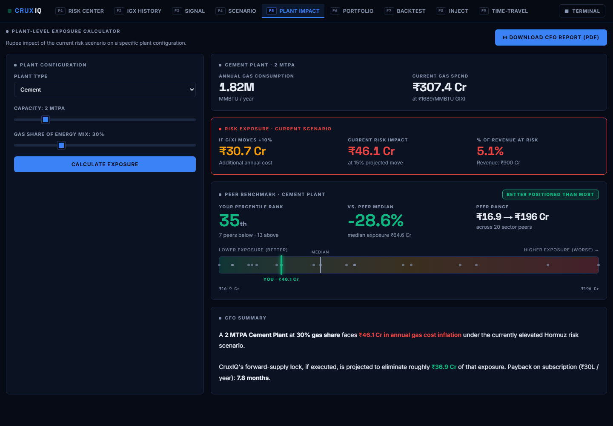
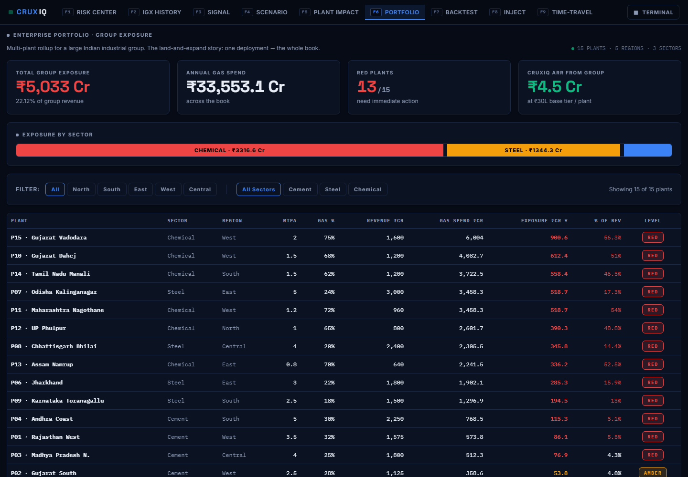
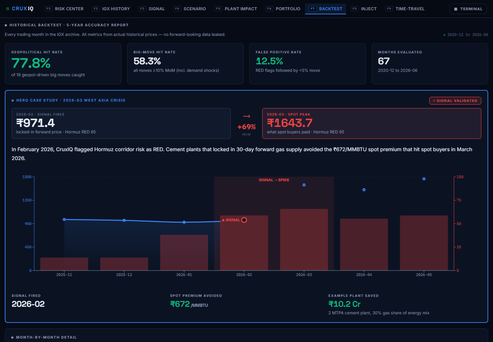
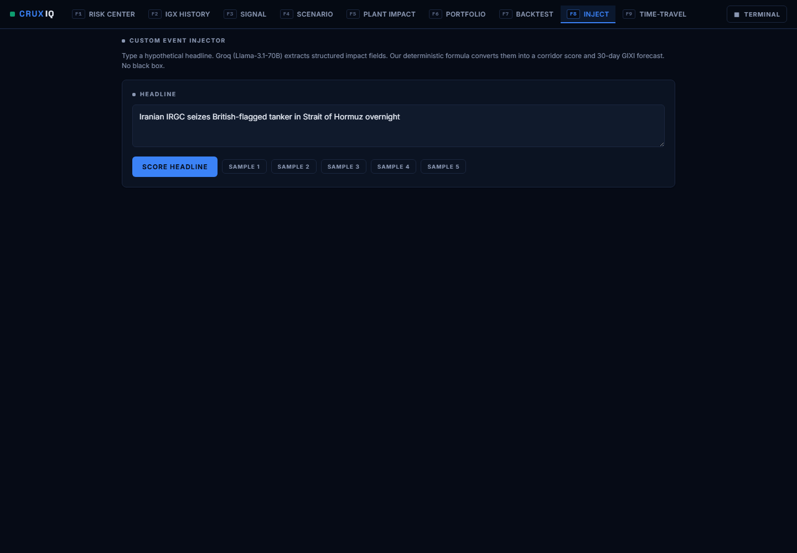
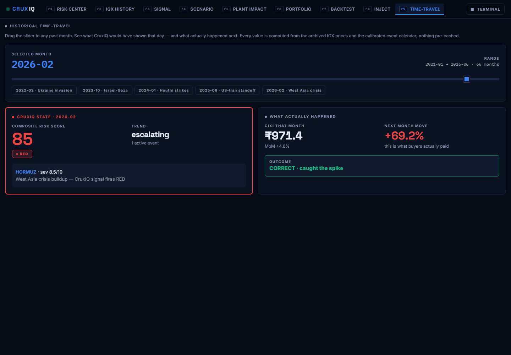

# CruxIQ — Judge Walkthrough

**ET AI Hackathon 2026 · Problem Statement 2: AI-Driven Energy Supply Chain Resilience for Import-Dependent Economies**

> India imports ~50% of its natural gas. When a geopolitical shock hits a shipping corridor, Indian industrial buyers find out from the price — 30 days too late. CruxIQ turns open-source geopolitical intelligence into a 30-day procurement signal for the CFOs of gas-dependent plants, and proves it works with a 5-year backtest on real IGX price data.

**Team:** Men in Market · **Repo:** https://github.com/Organic42/team-men-in-market-et-hackathon

---

## 1. The problem, in one number

In **March 2026**, the Indian Gas Exchange benchmark jumped **+69% month-on-month** (₹971 → ₹1,644/MMBTU) as the West Asia crisis escalated. Any plant buying spot that month paid a **₹672/MMBTU premium**. For a single 2 MTPA cement plant with 30% gas in its energy mix, that is roughly **₹10 crore of avoidable cost** — in one month.

The information needed to see it coming was public. The GDELT news firehose showed Hormuz corridor risk escalating through February. No mid-market Indian CFO has a system that reads it.

## 2. What CruxIQ does

```
GDELT (global news, free)  →  LLM event extraction (Groq / Llama)  →  deterministic corridor scoring
        →  30-day BUY / HEDGE / WAIT signal  →  ₹-crore plant impact  →  WhatsApp alert to the CFO
```

Three design decisions we want judges to notice:

1. **₹ before risk score.** The landing page leads with rupee exposure, not an abstract index. CFOs budget in crores, not in "risk units".
2. **LLM for reading, arithmetic for scoring.** The LLM only extracts structured events from news; the score itself is a deterministic weighted formula. Every score has a click-through audit trail (headlines → extracted JSON → scoring table). No hallucinated numbers.
3. **Backtested, not vibes.** Every claim is checked against 67 months of real IGX prices with no forward-looking data leaked.

## 3. Proof: 5-year backtest on real IGX data

Data: our own scrape of the Indian Gas Exchange — **11,926 rows, 1,397 trading days, Dec 2020 → Jul 2026** (shipped in the repo as `data/igx_daily.parquet`).

| Metric | Result |
|---|---|
| Months evaluated | **67** (2020-12 → 2026-06) |
| Geopolitical big moves caught | **77.8%** (of 18 geopolitics-driven ≥10% moves) |
| All big moves (incl. demand shocks) | 58.3% |
| Directional accuracy (all months) | 61.2% |
| False positive rate | **12.5%** (RED flags followed by <5% move) |

The system is honest about what it can and cannot see: it catches **geopolitical** supply shocks (its job) and misses pure demand shocks like the 2021-09 winter squeeze — the backtest screen shows both.

**Hero case:** CruxIQ's scoring flags Hormuz **RED in February 2026** — one month before the +69% spike. A plant that locked 30-day forward supply on that signal avoided the entire ₹672/MMBTU premium.

## 4. The product — 9 screens

All screenshots below are the live app (dark "Terminal" theme). A one-click toggle switches to a light "Boardroom" theme for CFO presentations.

### F1 · Risk Command Center
Rupee exposure first (live from the plant-impact engine), composite risk second. Three corridor metric cards (Hormuz / Red Sea / Caspian), live threat map, and a 72-hour event feed. Every corridor tile has a **"WHY?"** link that opens the full data-lineage audit trail.



### F2 · IGX Price History
Five and a half years of real IGX prices with geopolitical event markers — including the point where CruxIQ's signal fires ahead of the March 2026 spike.



### F3 · 30-Day Signal + WhatsApp delivery
The system's single actionable output: **BUY NOW / PARTIAL HEDGE / WAIT** with confidence and plain-language rationale. Below it, exactly how the CFO receives it — a WhatsApp Business alert rendered live from the same signal (typical latency GDELT → phone: under 90 seconds).



### F4 · Scenario Simulator
"What if Hormuz partially closes for 4 weeks at 80% severity?" — models the GIXI price path, import cost delta, and strategic-reserve runway using the same calibration constants the backtest validates.



### F5 · Plant Impact Calculator
Enter plant type, capacity, and gas share → rupee exposure at current risk, projected savings from a forward lock, and payback. Includes **peer benchmarking** (your exposure vs. an anonymised sector cohort, percentile-ranked) and a one-click **CFO PDF report** export.



### F6 · Portfolio View
The enterprise land-and-expand story: a 15-plant industrial group view — **₹5,033 Cr aggregate exposure, 13 plants flagged RED** — sortable and filterable by region and sector.



### F7 · Backtest Report
The full 67-month accuracy report with the March 2026 hero case study, month-by-month detail, and honest misses.



### F8 · Event Injector
Live-demo tool for judges: inject a hypothetical event ("explosion at Ras Tanura, severity 9") and watch scores, signal, and WhatsApp alert update end-to-end.



### F9 · Time-Travel
Drag a slider to any month since 2021 and see exactly what CruxIQ would have shown that day — and what actually happened next. This screen *is* the backtest, made tangible.



## 5. Architecture

```
GDELT news firehose ──► risk_scorer.py (Groq · Llama event extraction)
                              │  deterministic weighted scoring
IGX daily scraper ──► parquet archive (11,926 rows)
                              │
                        FastAPI (8 routers)
   /risk  /igx  /scenario  /plant  /backtest  /inject  + lineage
                              │
                    React SPA · 9 screens · dual themes
                    (Recharts, react-router, CSS-variable theming)
```

- **Backend:** FastAPI + pandas; Groq (`llama-3.1`) for extraction only; graceful fallback to cached events if the LLM is unavailable — the demo never breaks.
- **Frontend:** React + Vite + Recharts. Entire visual system is CSS variables → the Terminal/Boardroom theme switch is one attribute flip.
- **Deploy:** Netlify (frontend, `netlify.toml`) + Render (API, `render.yaml`).
- Full details: [ARCHITECTURE.md](../ARCHITECTURE.md) · Pitch deck: [DECK.md](../DECK.md)

## 6. Business model

- **Target:** ~2,000 mid-market Indian cement / steel / chemical / glass plants with meaningful gas exposure — too small for a Bloomberg terminal (₹20L+/seat), too exposed to ignore this.
- **Pricing:** ₹30L/plant/year. A single avoided spike (₹10 Cr for the reference plant) pays for **30+ years** of subscription.
- **Land and expand:** one plant → the group. The 15-plant portfolio view shown above is a ₹4.5 Cr ARR account.

## 7. Run it yourself

```bash
# Backend (Python 3.11+)
cd backend && pip install -r requirements.txt
# optional: put GROQ_API_KEY in backend/.env for live LLM extraction
uvicorn main:app --port 8000

# Frontend (Node 20+)
cd frontend && npm install && npm run dev
# open http://localhost:5173
```

The IGX archive ships in the repo — no scraping needed. Without a Groq key, the app runs fully on the cached event set.

---

*Generated for ET AI Hackathon 2026 judging · July 22, 2026*
